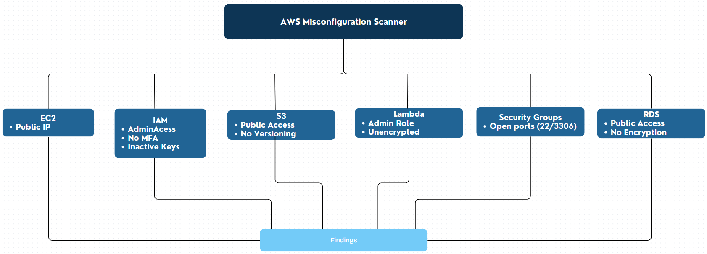

# AWS Misconfiguration Scanner

**Assessment Report**

  Prepared by: Tom Doyle
  
  Date: 16/06/2025
  
  Version: 1.0

**Automated AWS Cloud Security Scanner**  
This tool performs automated scanning across AWS services to detect common cloud misconfigurations that may lead to security exposure or violate AWS best practices.

## Acronyms

|  Acronym  |            Definition         |
|-----------|-------------------------------|
|    AWS    | Amazon Web Services           |
|    IAM    | Identity and Access Management|
|    MFA    | Multi-Factor Authentication   |
|    RDA    | Relational Database Service   |
|    S3     | Simple Storage Service        |
|    EC2    | Elastic Compute               |
|    SDK    | Software Development Kit      |

## Figure 1: AWS Misconfiguration Scanner Architecture and Coverage



## 1. Executive Summary
- This report presents the outcomes of an automated AWS Misconfiguration Scanner designed to identify and validate security misconfigurations across critical AWS services. The assessment focuses on detecting weaknesses that could lead to data breaches, unauthorized access, or compliance violations. The evaluation identified multiple critical and high-risk misconfigurations across core AWS services, exposing the environment to potential data compromise, privilege escalation, and compliance violations. Findings include IAM privilege escalation, publicly accessible resources, and insecure storage configurations, posing significant security, compliance, and business risks.

## 2. Introduction
- The AWS Misconfiguration Scanner automatically evaluates configurations across key AWS services, including EC2, IAM, Lambda, S3, RDS, and Security Groups. The scanner is designed to detect misconfigurations such as:
    - Publicly exposed compute, storage, and database resources
    - Excessive IAM privileges and administrative role assignments
    - Public S3 bucket access and missing versioning/encryption
    - Unused or stale IAM access keys
    - Unrestricted network security group ingress rules
 
  The results enable proactive remediation to strengthen security posture and reduce the opportunities to exploit poor configuration or weaknesses

## 3. Limitations and Scope
- The assessment was performed in a controlled AWS environment designed to simulate common misconfiguration scenarios. The scanner was tested against intentionally vulnerable AWS resources to validate detection capabilities. This report does not represent a full enterprise security audit or penetration test. All findings are limited to configurations actively deployed at the time of assessment

## 4. Methodology - Scanning Approach
- The scanner was built using the AWS SDK for Python (boto3)
- Each AWS service is queried via its respective API client
- Misconfigurations are detected through rule-based checks comparing resource configurations to AWS

## 4.1 Tech Stack

- Python 3.11
- **Primary library**: boto3 (AWS SDK for Python)
- **Execution environment**: Local Python scripts, GitHub Codespace, Docker
- **Modules**: Each AWS service scanner (e.g., ec2_scanner.py, s3_scanner.py) is modularized for maintainability
- **Reporting**: Terminal output listing scanner misconfiguration findings, transfered technical findings into structured report
- **CI/CD integration**: Scanners can be integrated into GitHub Actions for automated scanning (optional/future scope)
- **Logging**: Standard logging module used to track scanner activity and errors

## 4.2 Services Scanned

- **EC2** -> Detects public IP exposure on EC2 instances
- **IAM** -> Checks for root account usage, overly permissive wildcard policies, inactive access keys
- **Lambda** -> Verifies environment encryption, concurrency limits, resource policies
- **RDS** -> Detects public accessibility, disabled encryption, missing backup retention
- **S3** -> Identifies public buckets, missing encryption, missing versioning
- **Security Groups** -> Finds open ports and dangerous service exposures (e.g., SSH, RDP, databases)

## 5. Technical Findings

|    **Service**    |                  **Finding**                    |   **Risk**   |                               **Description**                                            |
|-------------------|-------------------------------------------------|--------------|------------------------------------------------------------------------------------------|
|**EC2**            |  Public IP exposure                             |  **High**    | Instance **i-0e9dffb42da5db6ee** is publicly accessible via assigned IP <IP Address>     |
|**IAM (Users)**    |  AdministratorAccess attached                   |  **Critical**| User **misconfig-scanner-user** has **AdministratorAccess** permissions directly assigned|
|**IAM (Roles)**    |  AdministratorAccess attached                   |  **Critical**| User **misconfig-test-lambda-role-mquga2ao** is assigned AdministratorAccess             |
|**Lambda**         |  Missing encryption / no concurrency limit      |  **Moderate**| One or more access keys have never been used or are inactive                             |
|**RDS**            |  Publicly Accessible Instance                   |  **High**    | RDS instance **misconfig-test-db** is publicly accessible                                |
|**Security Groups**|  Open ports: 22 (SSH)/ 3306 (TCP/MySQL, MariaDB)|  **High**    | SSH(22), MySQL(3306) and others are open to 0.0.0.0/0 (public internet)                  |
|**S3**             |  Public bucket policy versioning disabled       |  **High**    | Bucket **test-misconfig-aws-bucket** allows public access and versioning is disabled     |

## 6. Business Impact
- Risk of credential compromise due to excessive IAM permissions and unused access keys
- Potential for data breaches due to public exposure of cloud storage and databases
- Violation of compliance frameworks such as **ISO 27001**, **CIS AWS Foundations**, and **GDPR**
- Elevated risk of privilege escalation through overly permissive IAM roles
- Insufficent controls around identity, access management, and encryption

## 7. Essential Eight Alignment

|**Essential Eight Control**    |     **Coverage in Scanner**    | **Compliant**  |
|-------------------------------|--------------------------------|----------------|
|**Patch Applications**         |  Not covered                   | No             |
|**Patch Operating Systems**    |  Not covered                   | No             |
|**Multi-factor authentication**|  IAM MFA checks                | Partial        |
|**Restrict admin privileges**  |  IAM privilege escalation check| Yes            |
|**Application Control**        |  Not covered                   | No             |
|**Restrict Office Macros**     |  Not covered                   | No             |
|**User application hardening** |  Not covered                   | No             |
|**Regular Backups**            |  Not covered                   | No             |

## 8. Recommendations
- Apply Apply IAM Least Privilege and remove AdministratorAccess assignments
- Harden Security Group ingress rules to only allow trusted IP addresses and required ports
- Enforce strict S3 bucket policies with versioning and encryption enabled
- Disable public access on RDS instances unless explicitly required
- Regularly audit IAM users and deactivate unused access keys
- Encrypt Lambda environment variables to protect secrets in runtime
- Conduct periodic security configuration reviews to ensure ongoing compliance

## 9. Challenges faced / lessons learned

**Technical Implementation Challenges**

  - **Scanners not detecting anything:** After getting the code to run, it became apparent that the scanners (e.g., EC2, and S3) were not returning vulnerabilities, likely because there were no miscondfigurations to detect in the test AWS environment
  - **Modular Design Issues:** Issues arose whilst getting Python modules and imports to work properly (ec2_scanner.py, s3_scanner.py, etc...) especially when working in VS Code and Codespaces.
  - **HTML Output Styling:** Once the Bandit and ZAP scanners were integrated, adding an additional feature to return a styled, colour-coded HTML page after enforcing the risk threshold, which required tweaking how the program rendered its final output

**Testing and Validation:**
  - **No real vulnerabilities:** because the AWS environment didn't contain actual misconfiguration or sensitive data, testing the scanner's effectiveness was difficult. Differed simulations needed to be ran to be tested such as wrong permissiong for users and open public ports
**Cloud limitations:** Running ZAP and Bandit scans in the environment  sometimes didn't produce actionable results, and it wasn't always clear if that was due to limitations in the target or the scanner configuration

**Cloud Resource Contraints:** 
- **Cost of deploying full environments:** I became concious of the AWS costs, so the setup / scope of the project became restricted and minimal. This limited my ability to fully test a real-world enterprise level AWS misconfiguration across services like IAM, S3, EC2, etc...
- **Free tier limitations:** I had to constantly assess which instance types or configurations would remain within the AWS Free Tier or have minimal cost impact

**GitHub and Codespaces**
  - **Staging and pushing files:** Occasionally found it challenging to stage and push specfic files to the repository

**Security Awareness Concerns**
  - **Exposing PII:** Making sure no PII was in the S3 buckets and having live code on AWS and GitHub was a security concern

## 9. Conclusion
- The scanner successfully identified multiple critical misconfigurations that, if exploited, could lead to data compromise, privilege escalation, or service disruption. Timely remediation of these issues will not only reduce immediate security risks but also ensure alignment with best practices and cloud governance frameworks moving forward

## ⬇ Installation

1️⃣ Clone the repository:

```bash
git clone https://github.com/<Tom-Doyle-CyberSecurity>/aws-misconfig-scanner.git
cd aws-misconfig-scanner
